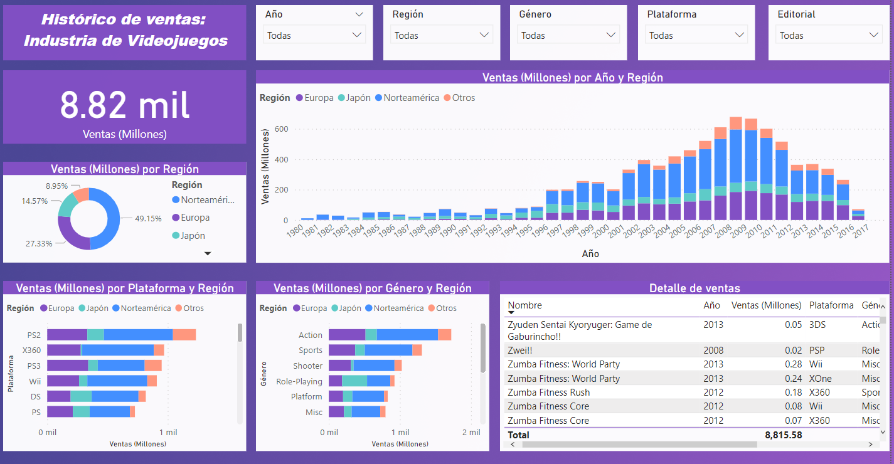
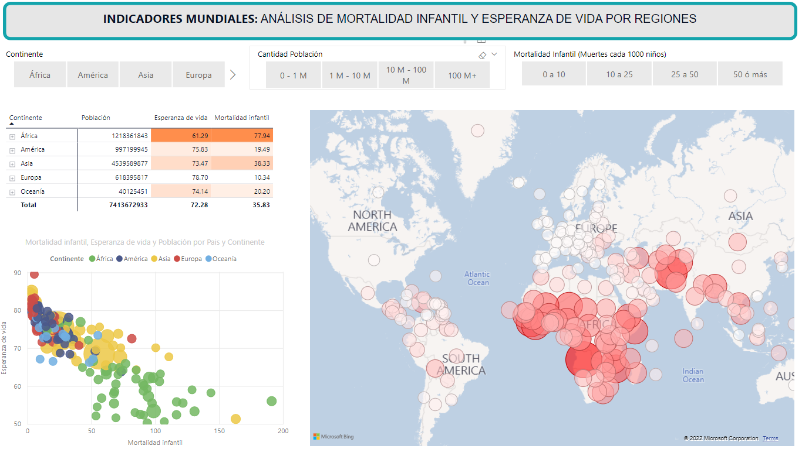

## Histórico de ventas: Industria de Videojuegos

Dashboard interactivo que muestra las ventas históricas desde los años 1980 hasta 2017, alcanzando el año 2008 el mayor número de ventas. Además es posible agrupar las ventas por regiones y por las diferentes plataformas o consolas, así como visualizar el género y la editorial que publicó el videojuego.

    

---

## Análisis de mortalidad infantil y esperanza de vida

    

---
